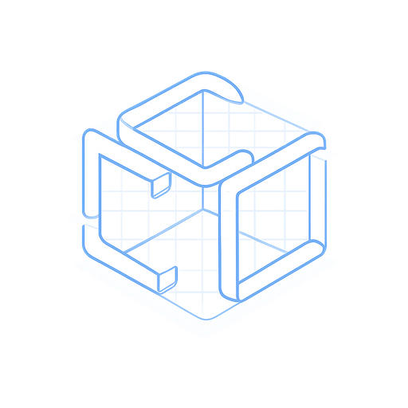
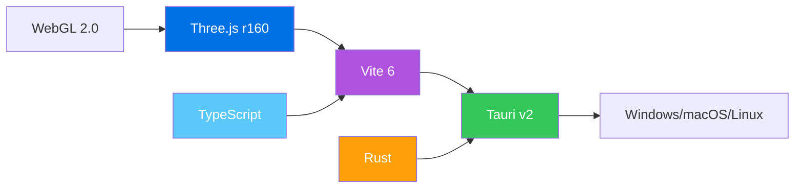

<div align="center">
  <br/>
  <br/>
  
  <br/>
  <br/>

# Model3D

### Next-Generation 3D Modeling · Sculpting · AI-Powered Creation

<br/>

[](https://github.com/xzclin/Model3D/releases)
[](https://github.com/xzclin/Model3D/actions)
[](LICENSE)
[](https://github.com/xzclin/Model3D/releases/latest)
[](https://v2.tauri.app)
[](https://threejs.org)

<br/>
<br/>

<p align="center">
  <a href="#-overview">Overview</a> •
  <a href="#-features">Features</a> •
  <a href="#-screenshots">Screenshots</a> •
  <a href="#-quick-start">Quick Start</a> •
  <a href="#-architecture">Architecture</a> •
  <a href="#-building">Building</a> •
  <a href="#-roadmap">Roadmap</a>
</p>

<br/>
<video src="https://engo.jupcloud.top/videocompress.ai-1783416384353.mp4" controls width="100%" poster="modeler-tauri/src-tauri/icons/icon.png"></video>

<br/>
</div>

---

<details open>
<summary><strong>🌐 README Languages</strong></summary>
<br/>

| Language | File |
|----------|------|
| 🇬🇧 English | `README.md` |
| 🇨🇳 简体中文 | [README.zh-CN.md](README.zh-CN.md) |
| 🇯🇵 日本語 | [README.ja.md](README.ja.md) |
| 🇰🇷 한국어 | [README.ko.md](README.ko.md) |
| 🇫🇷 Français | [README.fr.md](README.fr.md) |
| 🇩🇪 Deutsch | [README.de.md](README.de.md) |
| 🇪🇸 Español | [README.es.md](README.es.md) |
| 🇧🇷 Português | [README.pt-BR.md](README.pt-BR.md) |

</details>

---

## 📖 Overview

**Model3D** is a modern, cross-platform 3D modeling application built with [Tauri v2](https://v2.tauri.app) and [Three.js](https://threejs.org). It brings together **procedural modeling**, **real-time sculpting**, and **AI-powered generation** into one seamless desktop experience.

| Key Metric | Value |
|------------|-------|
| ⚡ Rendering Engine | WebGL 2.0 via Three.js r160 |
| 🖥 Desktop Framework | Tauri v2 (Rust + WebView) |
| 📦 Bundle Size | ~2 MB (NSIS installer) |
| 🌍 Platforms | Windows 10/11, macOS 12+, Linux (Ubuntu 22.04+) |
| 🎨 UI | Custom, dark-themed with GPU-accelerated animations |

---

## ✨ Features

<table>
<tr>
<td width="50%">

### 🏗️ 3D Modeling Suite
- **Procedural Geometry** — Box, sphere, cylinder, torus, and more
- **Smart Snapping** — Precision alignment with edge/vertex snapping
- **Real-time Transform** — Drag, scale, rotate with live feedback
- **Boolean Operations** — Union, subtract, intersect complex shapes
- **GLTF/GLB Export** — Standard format for game engines and 3D printers

</td>
<td width="50%">

### 🎨 Clay Sculpting Mode
- **Dynamic Topology** — Adaptive mesh resolution on the fly
- **Multi-brush System** — Push, pull, smooth, inflate, flatten
- **Real-time Subdivision** — Smooth preview at any detail level
- **Symmetry Mirror** — Work on both sides simultaneously
- **Intuitive Controls** — Pressure-sensitive brush dynamics

</td>
</tr>
<tr>
<td width="50%">

### 🤖 AI Modeling Assistant
- **Natural Language Input** — Describe your idea in plain text
- **Real-time Generation** — AI creates 3D models instantly
- **Smart Color Palette** — Automatic material assignment
- **Interactive Preview** — Rotate and inspect before exporting
- **Multi-language Support** — Works with English, 中文, 日本語, and more

</td>
<td width="50%">

### 📦 Asset Library & Import/Export
- **GLB Import** — Drag-and-drop model loading
- **JSON Format** — Flexible data interchange
- **Auto Material Mapping** — PBR material preservation
- **Scene Composition** — Multi-model workspace
- **Clipboard Export** — Copy models directly to your clipboard

</td>
</tr>
</table>

---

## 🖼️ Screenshots

<div align="center">
<table>
<tr>
<td></td>
<td></td>
</tr>
<tr>
<td align="center"><em>3D Modeling Viewport</em></td>
<td align="center"><em>Clay Sculpting Interface</em></td>
</tr>
<tr>
<td></td>
<td></td>
</tr>
<tr>
<td align="center"><em>AI Modeling Assistant</em></td>
<td align="center"><em>Asset Library Browser</em></td>
</tr>
</table>
</div>

---

## 🚀 Quick Start

### Prerequisites

| Dependency | Version | Installation |
|------------|---------|--------------|
| [Node.js](https://nodejs.org) | ≥ 18 | `winget install OpenJS.NodeJS.LTS` |
| [Rust](https://rustup.rs) | ≥ 1.77 | `winget install Rustlang.Rustup` |
| [Visual Studio Build Tools](https://visualstudio.microsoft.com/visual-cpp-build-tools/) | 2022 | Required for Windows |

### Installation

```bash
# Clone the repository
git clone https://github.com/xzclin/Model3D.git
cd Model3D/modeler-tauri

# Install frontend dependencies
npm install

# Run in development mode
npm run tauri dev

# Build for production
npm run tauri build
```

### 📦 Download Pre-built Binaries

| Platform | Download |
|----------|----------|
| 🪟 Windows | [⬇ Download EXE](https://github.com/xzclin/Model3D/releases/latest) |
| 🍎 macOS | [⬇ Download DMG](https://github.com/xzclin/Model3D/releases/latest) |
| 🐧 Linux | [⬇ Download AppImage](https://github.com/xzclin/Model3D/releases/latest) |
| 🌐 Web Demo | [🚀 Try Online](https://xzclin.github.io/Model3D/modeler.html) |

---

## 🏗️ Architecture

```
Model3D/
├── index.html                          # Main landing page
├── index_international.html            # International landing page (8 languages)
├── modeler.html                        # Web-based 3D modeler
│
├── modeler-tauri/                      # Desktop application
│   ├── package.json                    # Node.js dependencies
│   ├── vite.config.ts                  # Vite bundler config
│   ├── tsconfig.json                   # TypeScript config
│   │
│   ├── src/                            # Frontend source
│   │   ├── main.ts                     # Application entry point
│   │   ├── styles.css                  # Global styles
│   │   └── assets/                     # Static assets (SVGs, etc.)
│   │
│   └── src-tauri/                      # Tauri (Rust) backend
│       ├── Cargo.toml                  # Rust dependencies
│       ├── tauri.conf.json             # Tauri configuration
│       ├── build.rs                    # Build script
│       ├── src/
│       │   ├── main.rs                 # Desktop entry point
│       │   └── lib.rs                  # Library entry
│       ├── icons/                      # Application icons
│       └── capabilities/               # Tauri v2 permissions
│
└── .github/workflows/                  # CI/CD configuration
    └── build.yml                       # Cross-platform build pipeline
```

### Technology Stack



---

## 🔧 Building from Source

### Linux (Debian/Ubuntu)

```bash
# Install system dependencies
sudo apt update
sudo apt install -y \
  libwebkit2gtk-4.1-dev \
  build-essential \
  curl \
  wget \
  file \
  libssl-dev \
  libayatana-appindicator3-dev \
  librsvg2-dev \
  libgtk-3-dev \
  libsoup-3.0-dev \
  libjavascriptcoregtk-4.1-dev

# Build
cd modeler-tauri
npm run tauri build
```

### macOS

```bash
# Ensure Xcode Command Line Tools are installed
xcode-select --install

cd modeler-tauri
npm run tauri build
```

### Windows

```powershell
# Install Visual Studio Build Tools (C++ workload)
# Or use: winget install Microsoft.VisualStudio.2022.BuildTools

cd modeler-tauri
npm run tauri build
```

### ⚙️ Build Outputs

| Target | Format | Location |
|--------|--------|----------|
| Windows | `.msi`, `.exe` (NSIS) | `src-tauri/target/release/bundle/` |
| macOS | `.dmg` | `src-tauri/target/release/bundle/` |
| Linux | `.deb`, `.AppImage` | `src-tauri/target/release/bundle/` |

---

## 🗺️ Roadmap

- [x] **v0.1.0** — Basic 3D viewer with orbit controls
- [x] **v0.1.0** — GLTF/GLB export support
- [ ] **v0.2.0** — Procedural geometry generation
- [ ] **v0.3.0** — Clay sculpting engine
- [ ] **v0.4.0** — AI natural language to 3D
- [ ] **v0.5.0** — Material editor & PBR pipeline
- [ ] **v0.6.0** — Animation timeline
- [ ] **v1.0.0** — Stable release with plugin system

---

## 🤝 Contributing

Contributions are welcome! Please feel free to submit a Pull Request.

1. Fork the repository
2. Create your feature branch: `git checkout -b feat/amazing-feature`
3. Commit your changes: `git commit -m 'feat: add amazing feature'`
4. Push to the branch: `git push origin feat/amazing-feature`
5. Open a Pull Request

### Development Setup

```bash
# Clone and install
git clone https://github.com/xzclin/Model3D.git
cd Model3D/modeler-tauri
npm install

# Start development server with hot-reload
npm run tauri dev

# Lint and format
npm run lint   # (if configured)
```

---

## 📄 License

This project is licensed under the MIT License — see the [LICENSE](LICENSE) file for details.

```
MIT License

Copyright (c) 2026 xzclin

Permission is hereby granted, free of charge, to any person obtaining a copy
of this software and associated documentation files...
```

---

<div align="center">

**Model3D** — Built with ❤️ by [xzclin](https://github.com/xzclin)

<br/>

[](https://github.com/xzclin/Model3D)
[](https://github.com/xzclin/Model3D/fork)
[](https://twitter.com/xzclin)

<br/>
<sub>Made with Tauri v2 · Three.js · TypeScript · Rust</sub>

</div>
