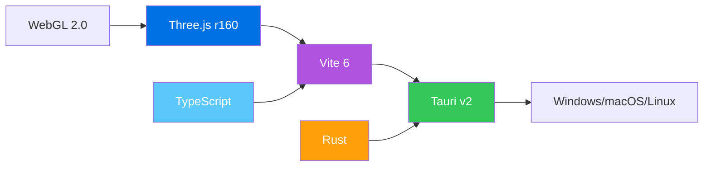

<div align="center">
  <br/>
  <br/>
  
  <br/>
  <br/>

# Model3D

### 下一代 3D 建模 · 雕刻 · AI 辅助创作

<br/>

[](https://github.com/xzclin/Model3D/releases)
[](https://github.com/xzclin/Model3D/actions)
[](LICENSE)
[](https://github.com/xzclin/Model3D/releases/latest)
[](https://v2.tauri.app)
[](https://threejs.org)

<br/>
<br/>

<p align="center">
  <a href="#-项目概览">项目概览</a> •
  <a href="#-功能特性">功能特性</a> •
  <a href="#-界面预览">界面预览</a> •
  <a href="#-快速上手">快速上手</a> •
  <a href="#-项目架构">项目架构</a> •
  <a href="#-构建指南">构建指南</a> •
  <a href="#-开发路线">开发路线</a>
</p>

<br/>

<p align="center">
  <a href="https://engo.jupcloud.top/videocompress.ai-1783416384353.mp4">▶ 点击观看演示视频</a>
  <br/>
  <br/>
  <video src="https://engo.jupcloud.top/videocompress.ai-1783416384353.mp4" controls width="100%"></video>
</p>

<br/>
</div>

---

<details open>
<summary><strong>🌐 多语言文档</strong></summary>
<br/>

| 语言 | 文档 |
|----------|------|
| 🇬🇧 英语 | `README.md` |
| 🇨🇳 简体中文 | [README.zh-CN.md](README.zh-CN.md) |
| 🇯🇵 日语 | [README.ja.md](README.ja.md) |
| 🇰🇷 韩语 | [README.ko.md](README.ko.md) |
| 🇫🇷 法语 | [README.fr.md](README.fr.md) |
| 🇩🇪 德语 | [README.de.md](README.de.md) |
| 🇪🇸 西班牙语 | [README.es.md](README.es.md) |
| 🇧🇷 葡萄牙语 | [README.pt-BR.md](README.pt-BR.md) |

</details>

---

## 📖 项目概览

**Model3D** 是一款现代化的跨平台 3D 建模应用，基于 [Tauri v2](https://v2.tauri.app) 和 [Three.js](https://threejs.org) 构建。它将**程序化建模**、**实时雕刻**和**AI 驱动生成**融为一体，带来流畅的桌面创作体验。

| 关键指标 | 详情 |
|------------|-------|
| ⚡ 渲染引擎 | 基于 Three.js r160 的 WebGL 2.0 |
| 🖥 桌面框架 | Tauri v2（Rust + WebView） |
| 📦 安装包大小 | 约 2 MB（NSIS 安装程序） |
| 🌍 支持平台 | Windows 10/11、macOS 12+、Linux（Ubuntu 22.04+） |
| 🎨 界面风格 | 深色自定义主题，GPU 加速动画 |

---

## ✨ 功能特性

<table>
<tr>
<td width="50%">

### 🏗️ 3D 建模套件
- **程序化几何体** — 立方体、球体、圆柱体、圆环等
- **智能吸附** — 边缘/顶点精确定位
- **实时变换** — 拖拽、缩放、旋转，即时反馈
- **布尔运算** — 并集、差集、交集，轻松构建复杂形状
- **GLTF/GLB 导出** — 兼容游戏引擎和 3D 打印的标准格式

</td>
<td width="50%">

### 🎨 黏土雕刻模式
- **动态拓扑** — 实时自适应网格细分
- **多笔刷系统** — 推、拉、平滑、膨胀、压平
- **实时细分** — 任意细节级别的平滑预览
- **对称镜像** — 左右同时雕刻，效率翻倍
- **直观操控** — 压力感应笔刷动态

</td>
</tr>
<tr>
<td width="50%">

### 🤖 AI 建模助手
- **自然语言输入** — 用文字描述你的创意
- **实时生成** — AI 即时创建 3D 模型
- **智能配色** — 自动匹配材质颜色
- **交互预览** — 导出前自由旋转查看
- **多语言支持** — 支持中文、英文、日文等

</td>
<td width="50%">

### 📦 资产库与导入/导出
- **GLB 导入** — 拖拽加载模型文件
- **JSON 格式** — 灵活的数据交换
- **自动材质映射** — 保留 PBR 材质属性
- **场景组合** — 多模型协同工作
- **剪贴板导出** — 一键复制模型到剪贴板

</td>
</tr>
</table>

---

## 🖼️ 界面预览

<div align="center">
<table>
<tr>
<td></td>
<td></td>
</tr>
<tr>
<td align="center"><em>3D 建模视口</em></td>
<td align="center"><em>黏土雕刻界面</em></td>
</tr>
<tr>
<td></td>
<td></td>
</tr>
<tr>
<td align="center"><em>AI 建模助手</em></td>
<td align="center"><em>资产库浏览器</em></td>
</tr>
</table>
</div>

---

## 🚀 快速上手

### 环境依赖

| 依赖项 | 版本要求 | 安装方式（Windows） |
|------------|---------|--------------|
| [Node.js](https://nodejs.org) | ≥ 18 | `winget install OpenJS.NodeJS.LTS` |
| [Rust](https://rustup.rs) | ≥ 1.77 | `winget install Rustlang.Rustup` |
| [Visual Studio Build Tools](https://visualstudio.microsoft.com/visual-cpp-build-tools/) | 2022 | Windows 必需 |

### 安装步骤

```bash
# 克隆仓库
git clone https://github.com/xzclin/Model3D.git
cd Model3D/modeler-tauri

# 安装前端依赖
npm install

# 开发模式运行
npm run tauri dev

# 生产环境构建
npm run tauri build
```

### 📦 下载预编译安装包

| 平台 | 下载链接 |
|----------|----------|
| 🪟 Windows | [⬇ 下载 EXE](https://github.com/xzclin/Model3D/releases/latest) |
| 🍎 macOS | [⬇ 下载 DMG](https://github.com/xzclin/Model3D/releases/latest) |
| 🐧 Linux | [⬇ 下载 AppImage](https://github.com/xzclin/Model3D/releases/latest) |
| 🌐 网页演示 | [🚀 在线体验](https://xzclin.github.io/Model3D/modeler.html) |

---

## 🏗️ 项目架构

```
Model3D/
├── index.html                          # 主着陆页
├── index_international.html            # 国际版着陆页（8 种语言）
├── modeler.html                        # 网页版 3D 建模器
│
├── modeler-tauri/                      # 桌面应用程序
│   ├── package.json                    # Node.js 依赖
│   ├── vite.config.ts                  # Vite 打包配置
│   ├── tsconfig.json                   # TypeScript 配置
│   │
│   ├── src/                            # 前端源码
│   │   ├── main.ts                     # 应用入口
│   │   ├── styles.css                  # 全局样式
│   │   └── assets/                     # 静态资源（SVG 等）
│   │
│   └── src-tauri/                      # Tauri（Rust）后端
│       ├── Cargo.toml                  # Rust 依赖
│       ├── tauri.conf.json             # Tauri 配置
│       ├── build.rs                    # 构建脚本
│       ├── src/
│       │   ├── main.rs                 # 桌面端入口
│       │   └── lib.rs                  # 库入口
│       ├── icons/                      # 应用图标
│       └── capabilities/               # Tauri v2 权限配置
│
└── .github/workflows/                  # CI/CD 配置
    └── build.yml                       # 跨平台构建流水线
```

### 技术栈



---

## 🔧 构建指南

### Linux（Debian/Ubuntu）

```bash
# 安装系统依赖
sudo apt update
sudo apt install -y \
  libwebkit2gtk-4.1-dev \
  build-essential \
  curl \
  wget \
  file \
  libssl-dev \
  libayatana-appindicator3-dev \
  librsvg2-dev \
  libgtk-3-dev \
  libsoup-3.0-dev \
  libjavascriptcoregtk-4.1-dev

# 构建
cd modeler-tauri
npm run tauri build
```

### macOS

```bash
# 确保已安装 Xcode Command Line Tools
xcode-select --install

cd modeler-tauri
npm run tauri build
```

### Windows

```powershell
# 安装 Visual Studio Build Tools（C++ 工作负载）
# 或使用：winget install Microsoft.VisualStudio.2022.BuildTools

cd modeler-tauri
npm run tauri build
```

### ⚙️ 构建产物

| 目标平台 | 格式 | 输出位置 |
|--------|--------|----------|
| Windows | `.msi`、`.exe`（NSIS） | `src-tauri/target/release/bundle/` |
| macOS | `.dmg` | `src-tauri/target/release/bundle/` |
| Linux | `.deb`、`.AppImage` | `src-tauri/target/release/bundle/` |

---

## 🗺️ 开发路线

- [x] **v0.1.0** — 基础 3D 查看器及轨道控制
- [x] **v0.1.0** — GLTF/GLB 导出支持
- [ ] **v0.2.0** — 程序化几何体生成
- [ ] **v0.3.0** — 黏土雕刻引擎
- [ ] **v0.4.0** — AI 自然语言转 3D
- [ ] **v0.5.0** — 材质编辑器与 PBR 管线
- [ ] **v0.6.0** — 动画时间轴
- [ ] **v1.0.0** — 稳定版本，插件系统

---

## 🤝 贡献指南

欢迎贡献代码！请随时提交 Pull Request。

1. Fork 本仓库
2. 创建特性分支：`git checkout -b feat/amazing-feature`
3. 提交更改：`git commit -m 'feat: 添加了某项精彩功能'`
4. 推送到分支：`git push origin feat/amazing-feature`
5. 提交 Pull Request

### 开发环境配置

```bash
# 克隆并安装
git clone https://github.com/xzclin/Model3D.git
cd Model3D/modeler-tauri
npm install

# 启动开发服务器（热重载）
npm run tauri dev

# 代码检查和格式化
npm run lint   # （如已配置）
```

---

## 📄 许可证

本项目采用 MIT 许可证 — 详见 [LICENSE](LICENSE) 文件。

```
MIT License

Copyright (c) 2026 xzclin

特此免费授予任何人获得本软件及相关文档文件（“软件”）副本的权利，
不受限制地处理本软件，包括但不限于使用、复制、修改、合并、发布、
分发、再许可和/或出售本软件副本的权利，并允许被提供本软件的人
这样做，但须满足以下条件...
```

---

<div align="center">

**Model3D** — 由 [xzclin](https://github.com/xzclin) 用 ❤️ 打造

<br/>

[](https://github.com/xzclin/Model3D)
[](https://github.com/xzclin/Model3D/fork)
[](https://twitter.com/xzclin)

<br/>
<sub>基于 Tauri v2 · Three.js · TypeScript · Rust 构建</sub>

</div>
